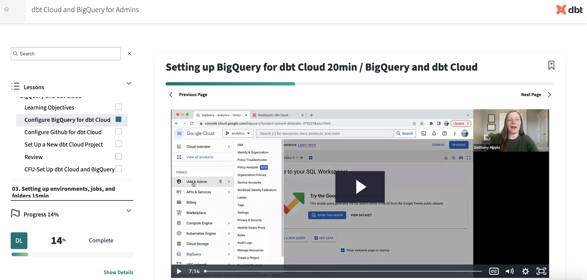

# Explainer and demo videos

## Explainer and demo video requirements

**Requirements.** Final versions of public courses feature instructional videos that support course learning objectives. Explainer videos give learners a high-level overview of a topic before they dive into details. Demo videos demonstrate the steps in a process, and go into detail. Demos should be 7-10 minutes maximum.

**Guidelines**. Explainer videos typically contain the instructor’s voice over slides, Lucid Chart diagrams, graphics, photos, or other images. Demo videos focus on processes in the dbt Cloud user interface or within a data platform. They describe specific actions, lead learners step by step, and provide guidance using the names of buttons, menus, and other interface elements.

**Example.** Refer to [**dbt Cloud and BigQuery for Admins On-Demand**](https://learn.getdbt.com/learn/course/dbt-cloud-and-bigquery-for-admins/setting-up-bigquery-for-dbt-cloud-20min/bigquery-and-dbt-cloud?page=2) for an example of well-structured explainer and demo videos aligned with learning objectives.

**Visual.** Screenshot from dbt Cloud and BigQuery for Admins

<figure><figcaption>
Figure 1.2 dbt Cloud and BigQuery for Admins Videos
</figcaption></figure>
